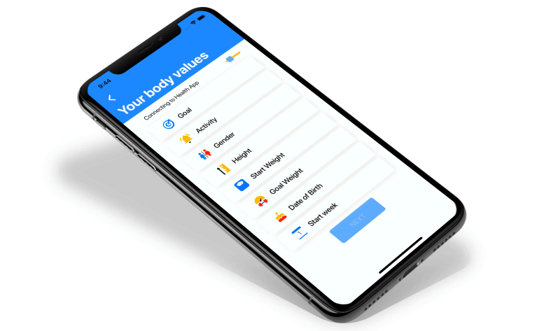
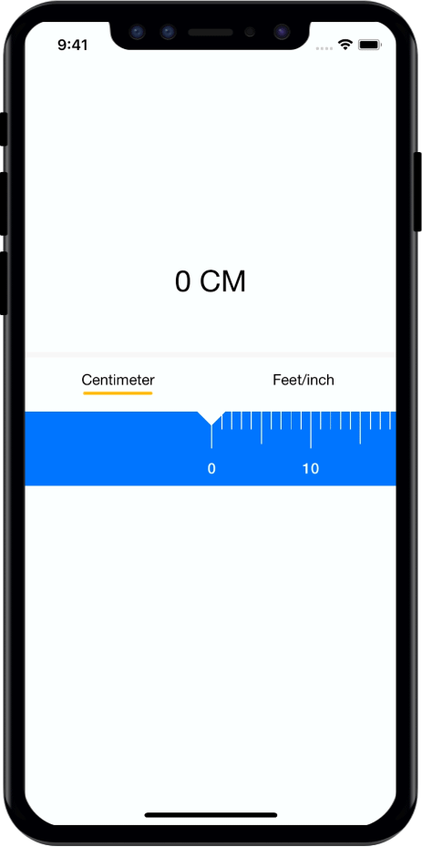

#  TYHeightPicker

It's custom height picker for your health app. you can you this where picking up height from user, Or you can use as a custom picker too.

 <br />
 
How to use 
---------


Import `YTHeightPicker.swift` into your project.

```swift
   class ViewController: UIViewController {
       
    var heighPicker: TYHeightPicker!
    
    override func viewDidLoad() {
        super.viewDidLoad()
        
        setupTYHeightPicker()
    }
    
    func setupTYHeightPicker() {
        heighPicker = TYHeightPicker()
        heighPicker.translatesAutoresizingMaskIntoConstraints = false
        heighPicker.delegate = self
        self.view.addSubview(heighPicker)
        
        heighPicker.leftAnchor.constraint(equalTo: self.view.leftAnchor).isActive = true
        heighPicker.rightAnchor.constraint(equalTo: self.view.rightAnchor).isActive = true
        heighPicker.centerYAnchor.constraint(equalTo: self.view.centerYAnchor).isActive = true
        heighPicker.heightAnchor.constraint(equalToConstant: 145).isActive = true
    }
    
}
```

Delegate Method 
---------


```swift
      func chooseHeight(height: CGFloat, unit: HeightUnit) {
        print(height, unit)
    }
```


